# Działanie na macierzach

### Wynik działania funkcji SUMA_MACIERZY
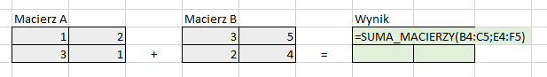
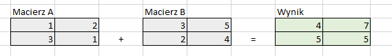

	Dla wymiarów niezgodnych:
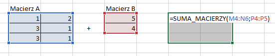
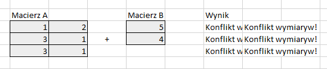

### Wynik działania funkcji MNOZENIE_MACIERZY
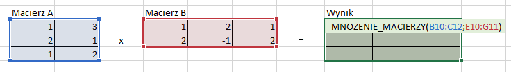
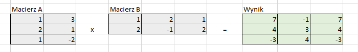

	Dla wymiarów niezgodnych (3x2 * 3x3):
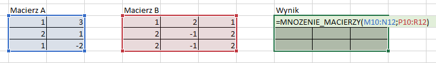
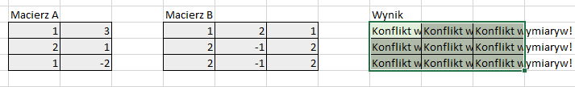

### Funkcja OBROT
- o 90 stopni
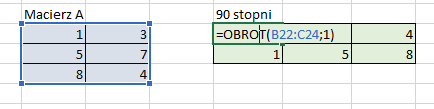
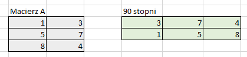

- o 180 stopni
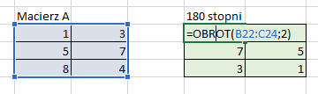
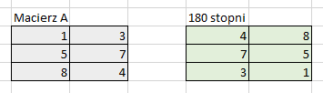